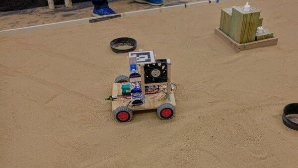
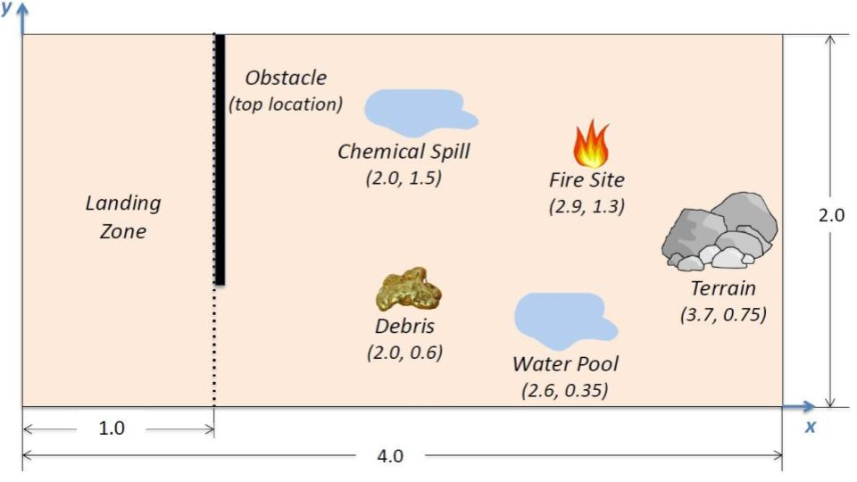

# OSV_Fire

This repository contains the code used by the 2017 Section 0201 Fire Group.
The Fire Group's Over Sand Vehicle (OSV) navigated a course
with obstacles, detected fires, detected the location of fires, extinguished
fires, and communicated with a computer using RF.

## Arena and Summary of Path

1.  The Obstacle would have either a top or bottom orientation. This would be random and the OSV would navigate past using an ultrasonic range sensor to look for an opening
2.  After exiting the Obstacle, the OSV would proceed towards the Fire site. It did not matter which way the OSV had to go around the Obstacle since it would calculate how to reach the Fire site either way (the Fire site's location were provided beforehand) using trig and algebra
3.  The OSV would use an array of 4 infrared light sensors while moving along the East side of the Fire Site to determine the location of the Fires. **Using logic, the OSV could deduce the locations of each fire without having to circumnavigate the whole Fire site**
4.  The OSV was equipped with a fan and it would blow the fires out

## Optimizations

- Capable of self correction when turning
- Capable of self correction in linear movement
- Calculates if it is faster to turn clockwise or counter clockwise when given a target destination
- Calculates which potential exit is faster to get to (since the OSV is slower while turning than moving, the fastest exit is not necessarily the closest exit)

## Requirements

Add the following necessary libraries before uploading to OSV:

1.  [umdenes100](https://github.com/umdenes100/arduinolibrary)
    - Rename to `enes100`
2.  [Adafruit_MotorShield](https://github.com/adafruit/Adafruit_Motor_Shield_V2_Library)
    - If you're using Linux, you may need to comment out the `yield()`
    - Rename to `Adafruit_MotorShield`
3.  Wire (check Sketch>Include Library>Recommended Libraries w/in
    the Arduino IDE)
4.  [NewPing](https://bitbucket.org/teckel12/arduino-new-ping/downloads/)
    - For the ultrasonic range sensor

## Team Members and Roles

**Ryan Howard**, Lead  
**Sean O'Connor**, Power  
**[Omkar Konaraddi](https://konaraddio.github.io)**, Navigation  
**Brittainy Sechler**, Structure  
**Roshan Rao**, Mechanics  
**Zach Peters**, Propulsion  
**Jimmy Alderisio**, Mission Performance  
**Keaton Paradeses**, Electronics  
